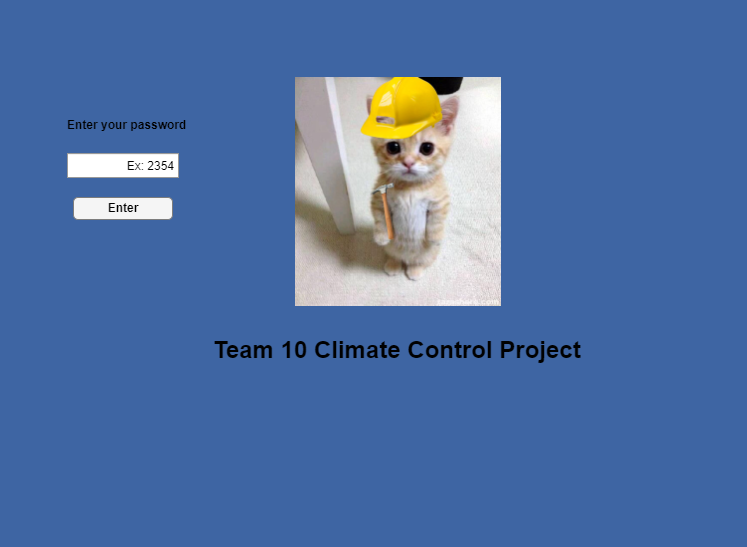
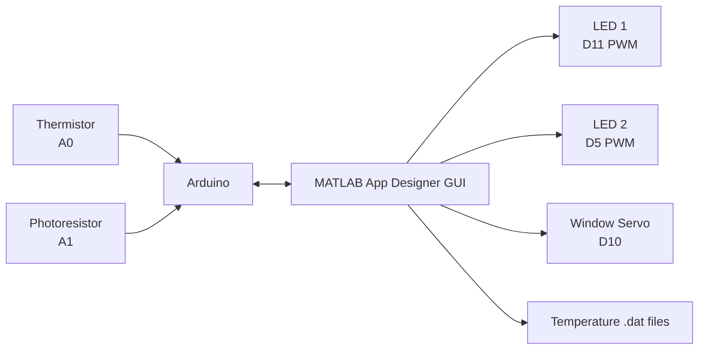

# Arduino Climate Control GUI


A MATLAB App Designer dashboard that monitors temperature and ambient light, controls two dimmable LEDs, and positions a servo-driven window through an Arduino.

This team project demonstrates hardware/software integration, sensor calibration, PWM output control, real-time GUI updates, and timestamped data logging.



## Features

- Live Fahrenheit temperature display from an NTC thermistor
- Ambient-light sensing through a photoresistor
- Automatic lighting that responds to measured light levels
- Manual controls for two independently switched, dimmable LEDs
- Servo-controlled window position
- Manual and automatic operating modes
- Timestamped temperature recording and plotting
- Simple password-gated demo interface

## System Overview



## Hardware

| Component | Arduino pin | Purpose |
| --- | --- | --- |
| NTC thermistor voltage divider | `A0` | Temperature measurement |
| Photoresistor voltage divider | `A1` | Ambient-light measurement |
| LED 1 | `D11` PWM | Dimmable light output |
| LED 2 | `D5` PWM | Dimmable light output |
| Servo motor | `D10` | Window position |

See [docs/HARDWARE.md](docs/HARDWARE.md) for wiring notes and the parts list.

## Requirements

- MATLAB with App Designer
- MATLAB Support Package for Arduino Hardware
- Arduino-compatible board connected by USB
- The components listed in [docs/HARDWARE.md](docs/HARDWARE.md)

The app package declares MATLAB R2018a as its minimum supported release. MATLAB R2025b was used for the packaged app supplied with this repository.

## Run the App

1. Assemble the circuit using the documented pin map.
2. Connect the Arduino to the computer by USB.
3. Open [`src/ArduinoClimateControl.mlapp`](src/ArduinoClimateControl.mlapp) in MATLAB.
4. Click **Run** in App Designer.
5. Enter the demo password `1234`.
6. Select manual or automatic mode and use the dashboard controls.

The app creates the Arduino connection automatically with `arduino`, so only one compatible board should be connected. Temperature recordings are saved as timestamped `.dat` files in MATLAB's current working folder.

## Engineering Notes

- Temperature is calculated from thermistor voltage with the Steinhart-Hart equation and converted to Fahrenheit.
- LED brightness is controlled with PWM duty cycles between `0` and `1`.
- The servo position slider maps `0-1` to approximately `0-180` degrees.
- Automatic mode inversely maps measured photoresistor voltage to LED brightness.
- Up to four temperature recordings can be loaded and plotted during one app session.

## Repository Structure

```text
.
|-- assets/
|   `-- app-login.png
|-- docs/
|   |-- DEMO.md
|   `-- HARDWARE.md
|-- src/
|   `-- ArduinoClimateControl.mlapp
|-- .gitignore
|-- LICENSE
`-- README.md
```

## Current Limitations

- The app requires connected hardware and does not currently include a simulation mode.
- The demo password is a UI gate, not a security boundary.
- The board and port are auto-detected rather than selected in the GUI.
- Data files are stored in the current MATLAB working folder.

## License

This project is available under the [MIT License](LICENSE).
